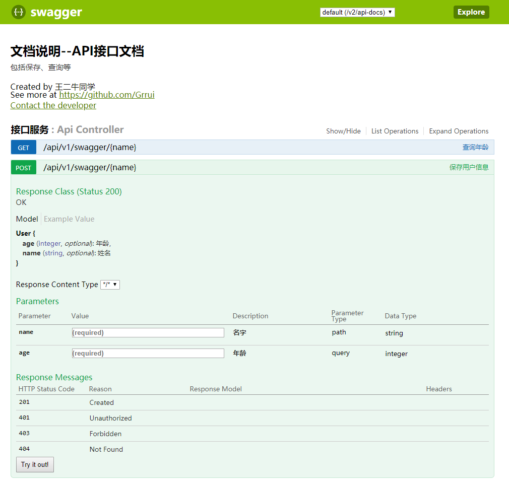

# Swagger2 注解

作为一个程序员，最讨厌两件事：
1. 前辈代码没有写文档！
2. 自己要去维护文档！  

偶然间从公司前辈那里了解到了swagger工具，可以帮助自动生成接口文档，就简单的了解一下，写了一个小demo。

## 1. 简介

swagger优势：
1. 文档自动生成。不用担心修改接口代码之后忘记更新文档的尴尬。
2. 支持在线测试。不需要再用postman等，可以直接进行测试，并获取内容。

当然还有很多优势，没有研究很深入，自己体会吧。

## 2. 集成Swagger(SpringBoot)

集成Swagger比较简单，大概分为三步：
1. 添加maven依赖。
2. 增加配置文件。
3. API接口增加swagger注解。

***只用了springboot的配置，非SpringBoot项目需要配置资源文件映射，具体可以参考官网！***

### 2.1. 增加maven依赖
```xml
<dependencies>
    <dependency>
        <groupId>io.springfox</groupId>
        <artifactId>springfox-swagger2</artifactId>
        <version>2.9.2</version>
    </dependency>
    
    <!--生成UI界面-->
    <dependency>
        <groupId>io.springfox</groupId>
        <artifactId>springfox-swagger-ui</artifactId>
        <version>2.9.2</version>
    </dependency>
</dependencies>
```

### 2.2. 增加配置文件
```java
@Configuration
@EnableSwagger2
public class Swagger2Config {

    @Bean
    public Docket controllerApi() {
        return new Docket(DocumentationType.SWAGGER_2)
                .apiInfo(new ApiInfoBuilder()
                        .title("文档说明--API接口文档")
                        .description("包括保存、查询等")
                        .contact(new Contact("王二牛同学", "https://github.com/Grrui", "grrui218@gmail.com"))
                        .version("版本号:1.0")
                        .build())
                .select()
                .apis(RequestHandlerSelectors.basePackage("com.example.swagger2.controller"))
                .paths(PathSelectors.ant("/api/**")) // 如果适配所有api，可以改为PathSelectors.any()
                .build();
    }
}
```

### 2.3. API接口增加swagger注解。

```java

@Api(tags = "接口服务", value = "/api/v1/swagger/**")
@RestController
@RequestMapping("/api/v1/swagger")
public class ApiController {

    @ApiOperation("保存用户信息")
    @ApiImplicitParams({
            @ApiImplicitParam(name = "name", value = "名字", required = true, paramType = "path"),
            @ApiImplicitParam(name = "age", dataType = "int", value = "年龄", required = true, paramType = "query")
    })
    @PostMapping("/{name}")
    @ResponseBody
    public Boolean save(
            @PathVariable("name") String name,
            @RequestParam("age") Integer age
    ) {
        userInfo.put(name, new User(name, age));
        return true;
    }
}
```  

**解释：**

学习的时候看到有大神总结过一篇很好的详解，这里直接贴出来了：
```
@Api：用在请求的类上，表示对类的说明
    tags="说明该类的作用，可以在UI界面上看到的注解"
    value="该参数没什么意义，在UI界面上也看到，所以不需要配置"

@ApiOperation：用在请求的方法上，说明方法的用途、作用
    value="说明方法的用途、作用"
    notes="方法的备注说明"

@ApiImplicitParams：用在请求的方法上，表示一组参数说明
    @ApiImplicitParam：用在@ApiImplicitParams注解中，指定一个请求参数的各个方面
        name：参数名
        value：参数的汉字说明、解释
        required：参数是否必须传
        paramType：参数放在哪个地方
            · header --> 请求参数的获取：@RequestHeader
            · query --> 请求参数的获取：@RequestParam
            · path（用于restful接口）--> 请求参数的获取：@PathVariable
            · body（不常用）
            · form（不常用）    
        dataType：参数类型，默认String，其它值dataType="Integer"       
        defaultValue：参数的默认值

@ApiResponses：用在请求的方法上，表示一组响应
    @ApiResponse：用在@ApiResponses中，一般用于表达一个错误的响应信息
        code：数字，例如400
        message：信息，例如"请求参数没填好"
        response：抛出异常的类

@ApiModel：用于响应类上，表示一个返回响应数据的信息
            （这种一般用在post创建的时候，使用@RequestBody这样的场景，
            请求参数无法使用@ApiImplicitParam注解进行描述的时候）
    @ApiModelProperty：用在属性上，描述响应类的属性
```

## 3.UI展示
启动项目，访问`http://localhost:8080/swagger-ui.html`(根据实际情况修改域名+端口)就可以展示并测试接口功能。



